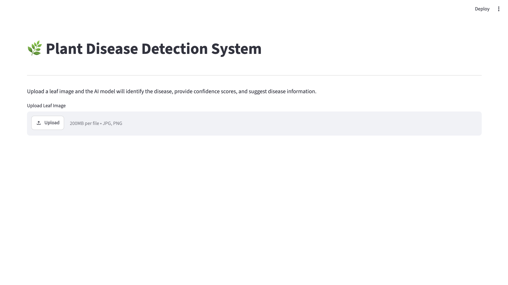
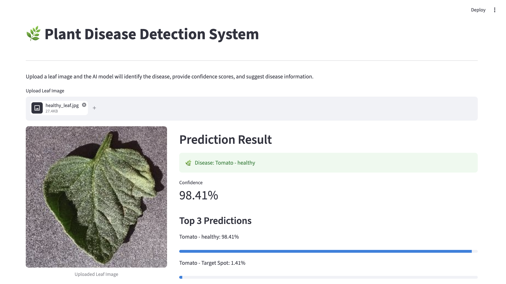
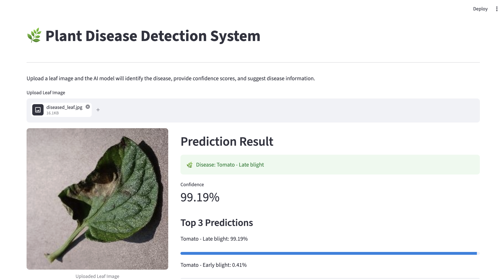
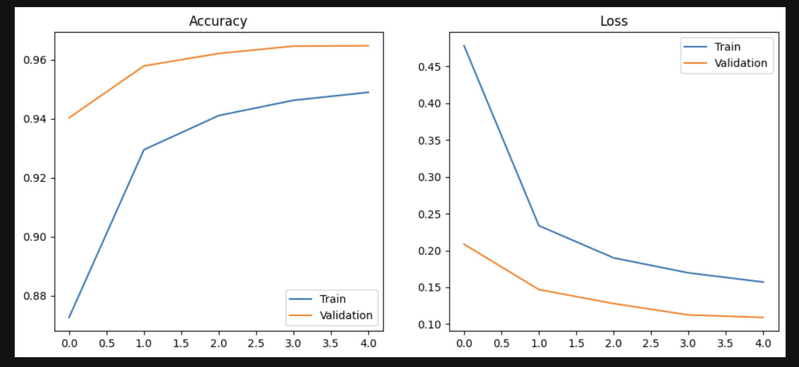
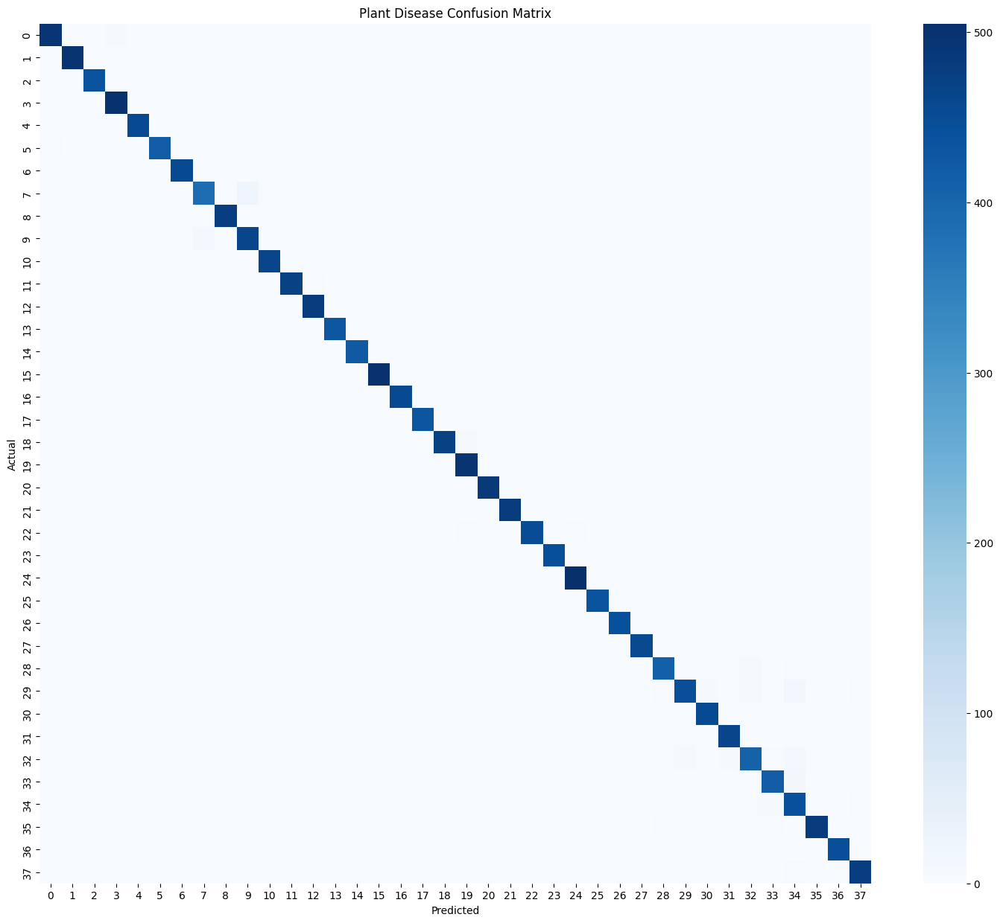
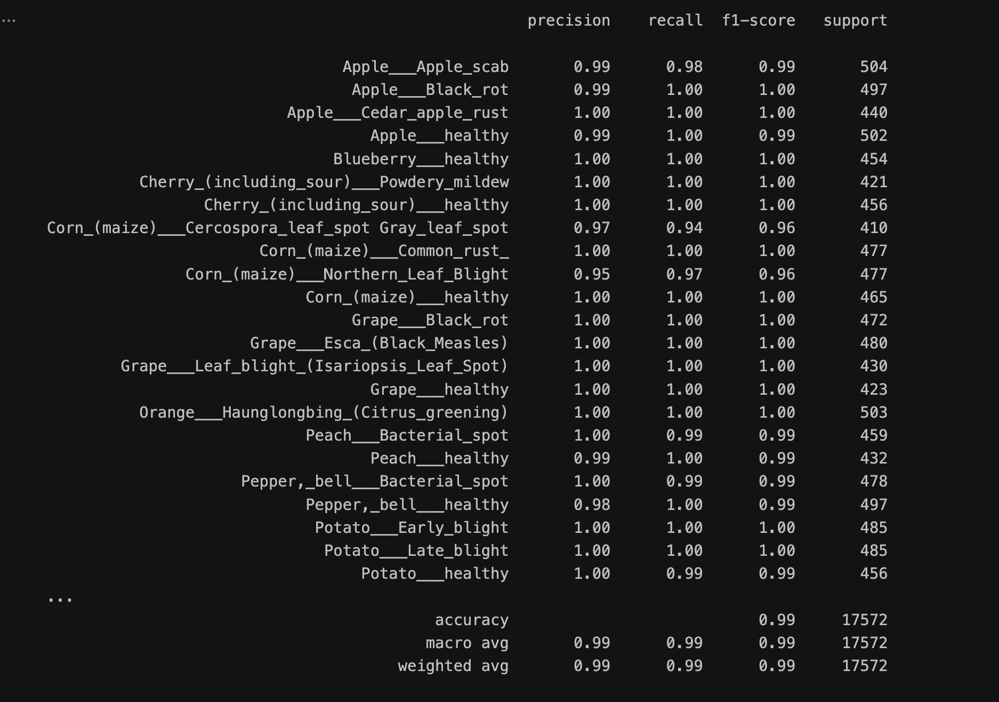

# PlantGuard-AI

PlantGuard-AI is a deep learning-based plant disease detection system that identifies diseases from leaf images using a fine-tuned EfficientNetB0 model.

The project includes a Streamlit web application where users can upload a leaf image and receive disease predictions along with confidence scores and disease information.

## Features

* Plant disease classification across 38 classes
* Transfer learning using EfficientNetB0
* Fine-tuned model for improved performance
* Streamlit-based web interface
* Top-3 predictions with confidence scores
* Disease information panel
* Clean and interactive user experience

## Dataset

This project uses the PlantVillage "New Plant Diseases Dataset" from Kaggle.

Dataset Statistics:

* Training Images: 70,295
* Validation Images: 17,572
* Classes: 38

## Model

Base Architecture: EfficientNetB0

Training Strategy:

* Transfer Learning
* Fine-Tuning
* Data Augmentation
* Early Stopping
* Model Checkpointing

### Results

| Metric              | Score  |
| ------------------- | ------ |
| Validation Accuracy | 98.82% |
| Validation Loss     | 0.0384 |

## Application Preview

### Home Screen



### Healthy Leaf Prediction

(screenshots/healthy_prediction2.png)

### Diseased Leaf Prediction

 (screenshots/diseased_prediction2.png)

## Training Visualizations

### Training Curves



### Confusion Matrix



### Classification Report



## Installation

```bash
git clone <repository-url>
cd PlantGuard-AI

python -m venv venv
source venv/bin/activate

pip install -r requirements.txt
```

## Run

```bash
streamlit run streamlit_app.py
```

## Future Improvements

* Grad-CAM visual explanations
* Additional disease information coverage
* Mobile-friendly deployment
* Real-time camera support

## Author

Vanshita Singh

B.Tech Information Technology
Manipal University Jaipur
