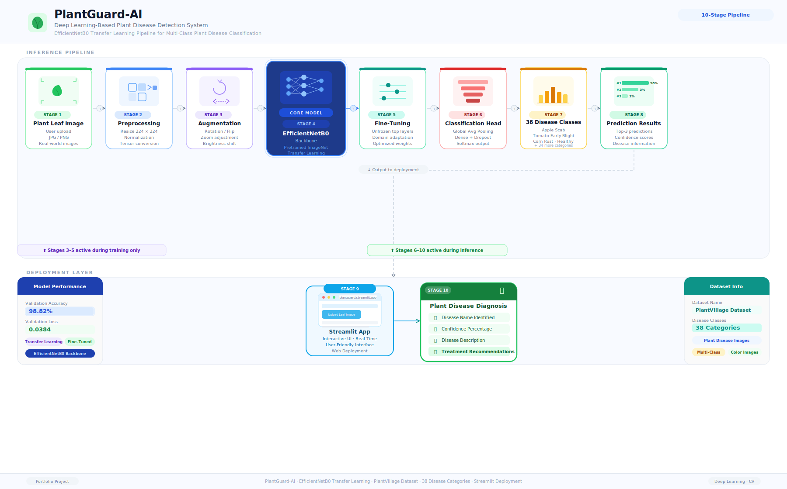

# PlantGuard-AI


PlantGuard-AI is a deep learning-based plant disease detection system that identifies plant diseases from leaf images using a fine-tuned EfficientNetB0 model.

The application provides disease predictions, confidence scores, top-3 predictions, and disease information through an interactive Streamlit web interface.

---

## Project Highlights

* Built a deep learning model capable of classifying 38 plant disease categories.
* Achieved **98.82% validation accuracy** using transfer learning and fine-tuning.
* Utilized EfficientNetB0 pretrained on ImageNet for feature extraction.
* Developed an interactive Streamlit web application for real-time predictions.
* Displayed Top-3 predictions with confidence scores and disease information.
* Implemented data augmentation, early stopping, and model checkpointing.

---

## Results

| Metric              | Value  |
| ------------------- | ------ |
| Validation Accuracy | 98.82% |
| Validation Loss     | 0.0384 |

---

## Live Demo

The application can be accessed online using Streamlit Cloud.

Demo Link: https://plantguard-ai.streamlit.app

---

## Features

* Classification of 38 plant disease categories
* Transfer learning using EfficientNetB0
* Fine-tuned model for improved accuracy
* Streamlit-based user interface
* Top-3 prediction display with confidence scores
* Disease information panel
* Image upload and real-time prediction

---

## Tech Stack

### Machine Learning

* TensorFlow
* Keras
* EfficientNetB0

### Application Development

* Streamlit

### Data Processing

* NumPy
* Pandas

### Visualization

* Matplotlib
* Seaborn

### Evaluation

* scikit-learn

---

## Dataset

### Dataset Details

* Dataset: PlantVillage
* Total Classes: 38
* 87,000+ Images
* RGB Leaf Images
* Healthy and Diseased Plant Categories

### Dataset Statistics

| Category          | Count  |
| ----------------- | ------ |
| Training Images   | 70,295 |
| Validation Images | 17,572 |
| Classes           | 38     |

Dataset Source:

https://www.kaggle.com/datasets/emmarex/plantdisease

---

## Model Architecture

Base Model: **EfficientNetB0**

## System Architecture



### Training Pipeline

1. Transfer Learning using ImageNet pretrained weights
2. Feature extraction with frozen base layers
3. Fine-tuning upper EfficientNet layers
4. Model checkpointing and validation monitoring

### Classification Head

* GlobalAveragePooling2D
* Dropout
* Dense (38 classes)

---

## Repository Structure

```text
PlantGuard-AI/
├── saved_models/
│   ├── best_finetuned_model.keras
│   ├── final_plant_disease_model.keras
│   └── plant_disease_transfer_learning.keras
│
├── notebooks/
│   ├── data_preprocessing.ipynb
│   ├── model_evaluation.ipynb
│   ├── gradcam.ipynb
│   └── confusion_matrix.ipynb
│
├── screenshots/
│   ├── app_home.png
│   ├── classification_report.png
│   ├── confusion_matrix.png
│   ├── training_curves.png
│   └── architecture_diagram.png
│
├── test_images/
├── streamlit_app.py
├── requirements.txt
├── README.md
└── LICENSE
```

---

## Installation

### Clone Repository

```bash
git clone https://github.com/vanshitax/PlantGuard-AI.git
```

### Navigate to Project Directory

```bash
cd PlantGuard-AI
```

### Install Dependencies

```bash
pip install -r requirements.txt
```

---

## Run Locally

```bash
streamlit run streamlit_app.py
```

---

## Application Preview

### Home Screen


### Healthy Leaf Prediction


### Diseased Leaf Prediction


---

## Training Visualizations

### Training Curves


### Confusion Matrix


### Classification Report


---

## Future Improvements

* Grad-CAM visual explanations
* Additional disease information coverage
* Mobile-friendly deployment
* Real-time camera integration

---

## Author

**Vanshita Singh**

B.Tech Information Technology
Manipal University Jaipur
