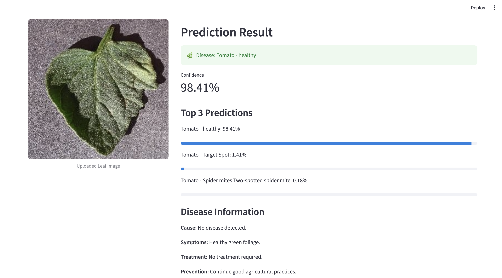
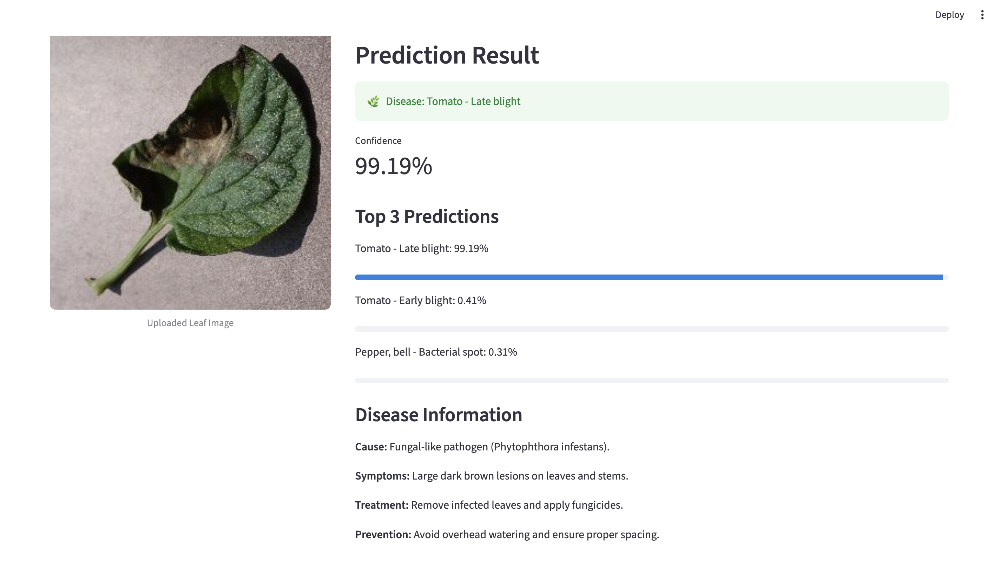

# PlantGuard-AI

PlantGuard-AI is a deep learning-based plant disease detection system that identifies plant diseases from leaf images using a fine-tuned EfficientNetB0 model.

The application provides disease predictions, confidence scores, top-3 predictions, and disease information through an interactive Streamlit web interface.

## Features

* Classification of 38 plant disease categories
* Transfer learning using EfficientNetB0
* Fine-tuned model for improved accuracy
* Streamlit-based user interface
* Top-3 prediction display with confidence scores
* Disease information panel
* Image upload and real-time prediction

## Tech Stack

### Machine Learning
- TensorFlow
- Keras
- EfficientNetB0

### Application Development
- Streamlit

### Data Processing
- NumPy
- Pandas

### Visualization
- Matplotlib
- Seaborn

### Evaluation
- Scikit-Learn

## Dataset

Dataset: PlantVillage - New Plant Diseases Dataset

### Dataset Statistics

| Category          | Count  |
| ----------------- | ------ |
| Training Images   | 70,295 |
| Validation Images | 17,572 |
| Classes           | 38     |

The dataset contains healthy and diseased leaf images from multiple crops including tomato, potato, corn, grape, apple, strawberry, peach, pepper, soybean, orange, raspberry, and cherry.

## Model Architecture

Base Model: **EfficientNetB0**

Training Pipeline:

1. Transfer Learning using ImageNet pretrained weights
2. Feature extraction with frozen base layers
3. Fine-tuning upper EfficientNet layers
4. Model checkpointing and validation monitoring

Classification Head:

* GlobalAveragePooling2D
* Dropout
* Dense (38 classes)

## Results

| Metric              | Value  |
| ------------------- | ------ |
| Validation Accuracy | 98.82% |
| Validation Loss     | 0.0384 |

## Application Preview

### Home Screen


### Healthy Leaf Prediction




### Diseased Leaf Prediction




## Training Visualizations

### Training Curves


### Confusion Matrix


### Classification Report


## Project Structure

```text
PlantGuard-AI
│
├── notebooks/
├── screenshots/
├── test_images/
├── streamlit_app.py
├── requirements.txt
└── README.md
```

## Installation

```bash
git clone https://github.com/vanshitax/PlantGuard-AI.git

cd PlantGuard-AI

pip install -r requirements.txt
```

## Run Application

```bash
streamlit run streamlit_app.py
```

## Future Improvements

* Grad-CAM visual explanations
* Additional disease information coverage
* Mobile-friendly deployment
* Real-time camera integration

## Author

Vanshita Singh

B.Tech Information Technology
Manipal University Jaipur
